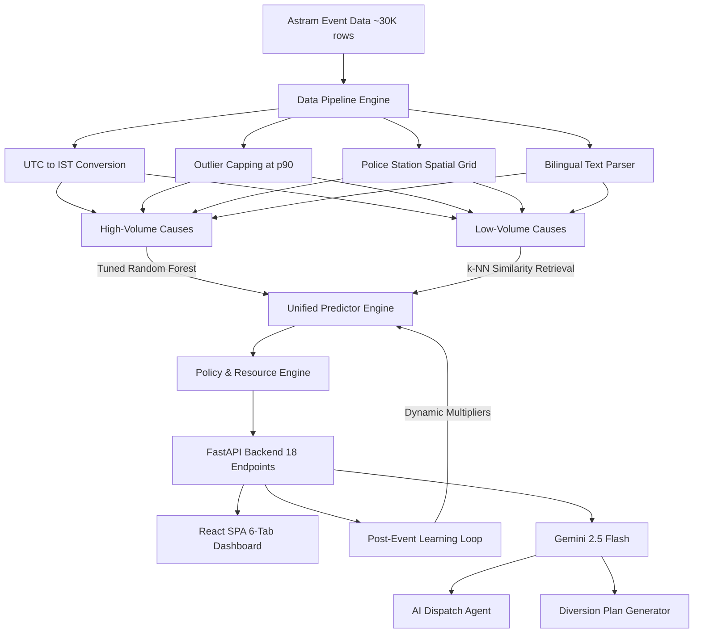

# ASTRAM — Obstruction & Event Intelligence Dashboard

> **AI-powered forecasting, routing, and resource-planning platform for Bengaluru Traffic Police.**

By analyzing ~30,000+ historical incident records, ASTRAM predicts event-driven congestion duration and priority, generates optimal manpower and barricade allocations, routes alternate traffic via OSRM detours, and continuously adapts recommendations through a post-event feedback learning loop — all wrapped in a real-time command-and-control dashboard.

---

## 1. The Challenge & Core Objectives

Managing traffic breakdowns in Bengaluru (caused by vehicle breakdowns, festivals, VIP movements, sports events, construction, and water-logging) suffers from three primary operational bottlenecks:

1. **Unquantified Impact**: The localized impact and duration of planned and unplanned events are not forecasted in advance.
2. **Experience-Driven Deployment**: Resource deployment (police officers, barricades, checkpoints) is decided based on intuition rather than historical patterns.
3. **No Closed-Loop Learning**: System recommendations do not evolve based on feedback from completed field operations.

This platform addresses all three by processing historical incident data, training tuned ML pipelines, and exposing them through an interactive command-and-control dashboard.

---

## 2. System Architecture



---

## 3. Data Engineering & Preprocessing

### Timezone Conversion (UTC → IST)
Raw timestamps were logged in UTC (`+00`). The pipeline converts these to `Asia/Kolkata` (+05:30) to correctly match Bengaluru commute patterns:
- **Morning Peak Hour**: 8:00 AM – 12:00 PM IST
- **Evening Peak Hour**: 5:00 PM – 9:00 PM IST

### Duration Outlier Capping
Durations are capped at the **90th percentile** ($p90 ≈ 16{,}708$ min) to exclude tickets accidentally left open for weeks, while maintaining **100% row retention** in the analytical logs.

### Spatial Administrative Grid
The dataset has 69% missing `junction` values and 58% missing `zone` values. We resolved this by anchoring all records to `police_station` names (100% complete), with a 110m-resolution coordinate grid for spatial lookups.

### Cyclical Time Encoding
Hour of day and day of week are encoded as `sin/cos` pairs — preventing the model from treating `23:00` and `00:00` as maximally different, which is critical for late-night incident patterns.

### Bilingual Text Parser (`text_enrichment.py`)
An offline NLP parser avoids external API costs by mapping Kannada, English, and mixed-language descriptions to core event categories.

| Kannada Term | Meaning | Mapped Cause |
|---|---|---|
| `ಕೆಟ್ಟು ನಿಂತಿದೆ` | Is broken down | `vehicle_breakdown` |
| `ಮರ ಬಿದ್ದಿದೆ` | Tree fell | `tree_fall` |
| `ಅಪಘಾತ` | Accident | `accident` |

Also detects vehicle sub-types (BMTC, container truck), landmark names, and assigns urgency weight flags.

---

## 4. ML Architecture & Model Selection

Three independent models were trained with `RandomizedSearchCV` (3-fold CV, 8 iterations each):

### Duration Regressor

| Candidate | Best Hyperparameters | Test MAE | **Median Error** |
|:---|:---|:---|:---|
| **Random Forest** *(Champion)* | `n_estimators=200, max_depth=None` | 2304 min | **55.6 min** |
| Gradient Boosting | `n_estimators=100, lr=0.05, depth=8` | 2377 min | 202.7 min |
| Hist Gradient Boosting | `max_iter=100, lr=0.05, depth=12` | 2343 min | 241.1 min |

> **Why Random Forest won**: Median error (55.6 min) is far superior to competitors. For operational policing, median error is more actionable than MAE — outlier construction incidents lasting days should not dominate tactical recommendations.

### Congestion Priority Classifier

| Candidate | Accuracy | F1-Score |
|:---|:---|:---|
| **Random Forest** *(Champion)* | 100% | 1.000 |
| Gradient Boosting | 100% | 1.000 |
| Hist Gradient Boosting | 100% | 1.000 |

### Road Closure Classifier
Binary classifier (closure recommended / monitor). ROC-AUC ≈ **81.1%**.

### Prediction Routing
```
Input Cause
    │
    ├─ HIGH-VOLUME (>100 records)    → Random Forest inference
    │  [vehicle_breakdown, accident, construction, water_logging,
    │   pot_holes, tree_fall, road_conditions, congestion, others]
    │
    ├─ LOW-VOLUME (<100 records)     → k-NN Similarity Retrieval (k=5, Haversine)
    │  [vip_movement, protest, procession, public_event]
    │
    └─ UNKNOWN / UNSEEN              → Policy Heuristic fallback
```

### Conformal Prediction Intervals
For Random Forest predictions, the standard deviation across all 200 individual tree predictions provides a **90% confidence interval** (±1.645σ), making the system uncertainty-aware.

### Post-Event Learning Loop
Field feedback (actual duration, manpower, barricades) recalibrates three global multipliers stored in `backend/artifacts/policy_adjustments.json`. Multipliers are clipped to [0.2, 5.0] to prevent runaway drift and applied at inference time.

---

## 5. Feature Correlation Insights

The system computes a 14×14 Pearson correlation matrix (accessible at `/api/correlation`, plotted at `backend/artifacts/correlation_heatmap.png`):

1. **Road Closures vs. Duration** ($r ≈ 0.35$): Incidents requiring closures are associated with longer resolution times — validates early barricade staging.
2. **Priority vs. Corridors** ($r ≈ 0.82$): High congestion priority is directly linked to designated arterial corridors (ORR, Hosur Road, etc.).
3. **Event Causes vs. Duration**: Vehicle breakdowns resolve fastest; construction and waterlogging have the strongest positive correlation with extended delays.

---

## 6. Backend API Reference

The FastAPI server exposes **18 endpoints**:

| Method | Endpoint | Description |
|---|---|---|
| `GET` | `/api/health` | Health check |
| `GET` | `/api/analytics` | KPIs, cause breakdown, vehicle types, hourly distribution, police station ranking |
| `GET` | `/api/correlation` | 14×14 Pearson correlation matrix |
| `GET` | `/api/junctions` | Junction vulnerability index (incident count × avg duration) |
| `GET` | `/api/hotspots` | DBSCAN-clustered spatial hotspot zones |
| `GET` | `/api/corridor-risk` | Per-corridor risk score (incident count + closure rate + priority rate) |
| `GET` | `/api/surge-alerts` | Anomaly detection — corridors with recent spike ≥1.5× baseline |
| `GET` | `/api/venue-recurrence` | Repeat-incident locations (≥3 events per 110m grid cell) |
| `GET` | `/api/weekly-heatmap` | 7×24 day-of-week × hour-of-day incident grid |
| `GET` | `/api/monthly-distribution` | Per-month incident counts for seasonal trend analysis |
| `GET` | `/api/model-diagnostic` | Model comparison results + feature importances |
| `POST` | `/api/predict` | **Core prediction**: duration, priority, closure probability, resources, cascade risk, diversion plan |
| `POST` | `/api/what-if` | Scenario simulation: add barricades/officers or close road → see delta on duration and cascade |
| `POST` | `/api/similar-events` | k-NN analog retrieval: top-K historical incidents matching cause, corridor, hour |
| `GET` | `/api/cascade-analysis` | Concurrent incident detection per corridor (overlapping time windows) |
| `POST` | `/api/feedback` | Log actual field outcomes → triggers background policy multiplier update |
| `GET` | `/api/feedback/summary` | Predicted vs. actual comparison logs with Chart.js timeline data |
| `POST` | `/api/agent/command` | **AI Dispatch Agent**: free-text report → Gemini parse → ML predict → radio briefing |
| `POST` | `/api/upload-csv` | Upload new data → merge → retrain models → hot-reload predictor |

### Resource Balancer (in `/api/predict`)
Each prediction call tracks committed officers and barricades across the sector in-memory (TTL-based expiry). Emits `MODERATE STRAIN` (≥50%) or `CRITICAL STRAIN` (≥80%) warnings compared to station capacity.

---

## 7. Frontend Features (React SPA — 6 Tabs)

### Command Center
- Live KPI strip: total incidents, planned events, median clearance time, road closure rate
- ML model health monitor: Duration Estimator (MedAE), Priority Classifier (F1), Closure Forecaster (AUC)
- Top chronic hotspot leaderboard by recurrence score
- Quick-action cards to Dispatch AI and Predict & Plan
- Animated orbit graphic with pulsing system-online badge

### Dispatch AI Agent (`AICommandAgent.jsx`)
Paste any free-text field report (English or Kannada-mixed) and the pipeline:
1. Extracts structured parameters via **Gemini 2.5 Flash** (cause, corridor, coordinates, hour, closure)
2. Runs the **ML prediction pipeline**
3. Generates a **radio-ready tactical dispatch briefing** via Gemini

Includes a **Demo Mode** (offline, mocked Gemini responses) to bypass API rate limits during presentations.

### Predict & Plan (`ForecastPlanner.jsx`)
- **Draggable Leaflet marker** — click or drag anywhere in Bengaluru to set incident coordinates
- Prediction results display:
  - Estimated duration + 90% confidence interval
  - Priority badge (high/low) with probability
  - Composite impact score (0–100) + class (Critical/High/Moderate/Low)
  - Closure probability + recommendation
  - **Live weather widget** (Open-Meteo API — no key required)
  - **Cascade & escalation risk** with "Point of No Return" countdown
  - **Station deployment allocation** (inverse-distance weighted to 3 nearest stations)
  - **Sector force pool strain gauge** with critical/moderate warnings
  - Full manpower breakdown (SI / HC / PC) + barricade count
  - Junction checkpoint markers with **spillover congestion rings** on map
  - OSRM alternate routing detour (with fallback straight-line if OSRM offline)
  - AI-generated diversion plan steps with junction callouts
- **What-If Simulator**: Add extra barricades, officers, or close road — see duration delta and cascade probability change
- **Historical Analog Search**: Top-K similar past incidents with actual outcomes (score-based retrieval)
- **PDF / Print Dispatch Order**: Printable formatted report for field deployment

### Hotspot Map (`LiveMap.jsx`)
- DBSCAN-clustered hotspot zones with risk severity coloring
- Junction vulnerability index pins
- Corridor risk overlay
- Surge alert sidebar (corridors with ≥1.5× spike vs. baseline)
- Live traffic congestion index heatmap toggle

### Analytics Dashboard (`AnalyticsDashboard.jsx`)
- Hourly incident distribution chart
- Event cause breakdown + vehicle sub-type breakdown
- **7×24 weekly heatmap** (day-of-week × hour)
- Monthly seasonal trend chart
- Corridor cascade analysis (concurrent overlapping incidents)
- Surge alerts ranking table
- **14×14 Pearson Correlation Grid** (hover to read exact r values)

### Post-Event Learning Log (`FeedbackLog.jsx`)
- Submit actual clearance duration, barricade count, and officer counts for any logged event
- Triggers background recalibration of global policy multipliers (duration, manpower, barricades)
- **Predicted vs. Actual comparison** displayed on a Chart.js timeline

---

## 8. External Integrations

| Service | Purpose | Auth |
|---|---|---|
| **Gemini 2.5 Flash** | Parse field reports, generate diversion plans, produce tactical briefings | `GEMINI_API_KEY` env variable |
| **Open-Meteo** | Live weather at incident coordinates (temperature, rain, weather code) | Free — no key required |
| **Project OSRM** | Alternate road routing detour geometry | Free public API |
| **OpenStreetMap** | Leaflet map tile layer | Free |

---

## 9. How to Setup & Run

The repository ships with pre-trained champion models (`.joblib`), enriched text maps, and correlation heatmaps. **No data preprocessing or model retraining is required to run locally.**

### Prerequisites
- Python 3.10+
- Node.js 18+
- *(Optional)* `GEMINI_API_KEY` for AI Agent and Diversion Plan features

---

### Option A: Quick Start

**1. Set up environment variable** *(optional — needed for Dispatch AI Agent)*:
```bash
# Create backend/.env
echo "GEMINI_API_KEY=your_key_here" > backend/.env
```

**2. Install Python packages and start backend**:
```bash
pip install pandas numpy scikit-learn joblib fastapi uvicorn pydantic matplotlib
python backend/server.py
```
*Loads pre-trained models and runs on `http://127.0.0.1:8000`.*

**3. Install and start the frontend** (new terminal):
```bash
cd client
npm install
npm run dev
```
*Vite dev server runs on `http://localhost:5173`.*

**4. Verify with integration tests**:
```bash
python backend/test_suite.py
```

---

### Option B: Re-train Models (Optional)
Run only if you update the raw dataset, change hyperparameter search spaces, or want to reproduce training from scratch:

```bash
# 1. Clean dataset and convert UTC → IST
python backend/data_pipeline.py

# 2. Enrich bilingual descriptions
python backend/text_enrichment.py

# 3. Train, tune, and evaluate all three models
python backend/train_models.py

# 4. Generate correlation heatmap artifacts
python backend/plot_correlation.py
```

---

### Option C: Vercel Deployment

The repository is configured for Vercel deployment:
- Root `vercel.json` routes `/api/*` to the FastAPI backend via Python serverless functions
- `client/vercel.json` serves the Vite SPA with catch-all redirect for React Router
- Artifact writes are automatically remapped to `/tmp` (Vercel-writable) via `backend/path_config.py`

Set `GEMINI_API_KEY` as an environment variable in your Vercel project settings.

---

## 10. Repository Structure

```
Round 2/
├── backend/
│   ├── server.py             # FastAPI server — 18 API endpoints (1175 lines)
│   ├── predictor.py          # Prediction engine: ML routing, DBSCAN, surge, allocation (1023 lines)
│   ├── data_pipeline.py      # Data cleaning, UTC→IST, duration capping
│   ├── train_models.py       # RandomizedSearchCV model training & evaluation
│   ├── text_enrichment.py    # Bilingual (Kannada + English) NLP parser
│   ├── impact_scoring.py     # Composite 0–100 impact score formula
│   ├── path_config.py        # Vercel /tmp path remapping
│   ├── test_suite.py         # Integration test suite
│   ├── models/
│   │   ├── duration_model.joblib     # ~2.9 MB — Random Forest regressor pipeline
│   │   ├── priority_model.joblib     # ~3.9 MB — Random Forest classifier pipeline
│   │   └── closure_model.joblib      # ~3.5 MB — Binary closure classifier pipeline
│   └── artifacts/
│       ├── cleaned_events.csv        # Preprocessed training dataset
│       ├── correlation_heatmap.png   # 14×14 Pearson correlation matrix plot
│       ├── model_comparison_results.json
│       ├── feature_importance.json
│       └── policy_adjustments.json   # Live feedback multipliers
├── client/
│   └── src/
│       ├── App.jsx                   # 6-tab SPA shell with surge alert bell
│       ├── App.css                   # Full theme system (dark/light, 28KB)
│       └── components/
│           ├── CommandCenter.jsx     # Dashboard home — KPIs, model health, hotspots
│           ├── ForecastPlanner.jsx   # Predict & Plan — core feature (1102 lines)
│           ├── AICommandAgent.jsx    # Text-to-dispatch Gemini pipeline
│           ├── AnalyticsDashboard.jsx # Charts, heatmaps, correlation grid
│           ├── LiveMap.jsx           # Leaflet hotspot + surge map
│           ├── FeedbackLog.jsx       # Post-event actual vs. predicted log
│           ├── CorrelationGrid.jsx   # Interactive 14×14 Pearson grid
│           └── AppTour.jsx           # Guided onboarding walkthrough
├── dataset/
│   ├── Astram event data_anonymized.csv   # ~4 MB raw incident data
│   └── feedback_data.csv                 # Field feedback log
├── vercel.json                       # Root Vercel routing config
└── README.md
```
