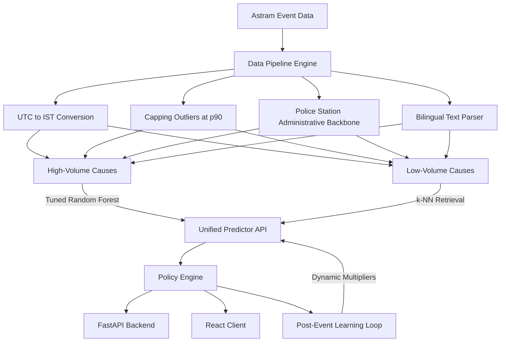

# ASTRAM Obstruction & Event Intelligence Dashboard
 
An AI-powered forecasting, routing, and resource-planning platform built for Bengaluru Traffic Police. By analyzing historical event and obstruction logs, the system predicts incident duration and congestion priority, generates optimal manpower and barricade allocations, maps alternate routes via OSRM detours, and integrates a post-event learning loop to continuously adapt recommendations based on field feedback.

---

## 1. The Challenge & Core Objectives
Managing traffic breakdowns in Bengaluru (caused by vehicle breakdowns, festivals, VIP movements, sports events, construction, and water-logging) suffers from three primary operational bottlenecks:
1. **Unquantified Impact**: The localized impact and duration of planned and unplanned events are not forecasted in advance.
2. **Experience-Driven Deployment**: Resource deployment (police officers, barricades, checkpoints) is decided based on intuition rather than historical patterns.
3. **No Closed-Loop Learning**: System recommendations do not evolve based on feedback from completed field operations.

This platform addresses these challenges by processing historical incident data, training tuned machine learning pipelines, and wrapping them in an interactive command-and-control map console.

---

## 2. System Architecture

The application is structured as a decoupled full-stack system:



---

## 3. Data Engineering & Preprocessing

### Timezone Conversion (UTC --> IST)
Raw dataset timestamps were logged in UTC (`+00`). The pipeline converts these to Bengaluru local time (`Asia/Kolkata` / `+05:30`) to correctly match local commute patterns:
* **Morning Peak Hour**: 8:00 AM – 12:00 PM IST
* **Evening Peak Hour**: 5:00 PM – 9:00 PM IST

### Capping Duration Outliers
To prevent massive resolution times (e.g., tickets accidentally left open for weeks) from skewing predictions, the pipeline caps durations at the 90th percentile ($p90 = 16,708.07$ minutes) during training, discarding administrative noise while maintaining $100\%$ row representation for logs.

### Spatial Administrative Grid
The dataset suffers from sparse spatial naming ($69\%$ missing `junction` values and $58\%$ missing `zone` values). We resolved this by building a coordinate grid ($110\text{m}$ resolution) and anchoring records to `police_station` names, which are $100\%$ complete.

### Bilingual Text Parser (`text_enrichment.py`)
To avoid latency and costs from external translation APIs, an offline NLP parser maps Kannada, English, and mixed descriptions to core events.
* **Kannada Translation Mapping**: Translates local terms like `ಕೆಟ್ಟು ನಿಂತಿದೆ` (is broken down), `ಮರ ಬಿದ್ದಿದೆ` (tree fell), and `ಅಪಘಾತ` (accident).
* **Regex Feature Extraction**: Detects landmarks, vehicle sub-types (BMTC bus, container), and assigns localized urgency weight flags.

---

## 4. Multi-Model Selection & Hyperparameter Tuning

We compared several machine learning architectures using cross-validated randomized search (`RandomizedSearchCV` with 3 folds, 8 iterations per model) to select the champion models.

### Duration Regressor Models (Capped Duration)

| Candidate Model | Best Hyperparameters | Test MAE | Test Median Error |
| :--- | :--- | :--- | :--- |
| **Random Forest Regressor** *(Winner)* | `n_estimators=200, max_depth=None, min_samples_split=2, min_samples_leaf=1` | **2304.17 mins** | **55.56 mins** |
| **Gradient Boosting Regressor** | `n_estimators=100, learning_rate=0.05, max_depth=8, min_samples_leaf=1` | 2377.05 mins | 202.73 mins |
| **Hist Gradient Boosting Regressor** | `max_iter=100, learning_rate=0.05, max_depth=12, min_samples_leaf=10` | 2342.68 mins | 241.11 mins |

### Congestion Priority Classifier Models

| Candidate Model | Best Hyperparameters | Test Accuracy | Test F1-Score |
| :--- | :--- | :--- | :--- |
| **Random Forest Classifier** *(Winner)* | `n_estimators=150, max_depth=14, min_samples_split=4, min_samples_leaf=4` | **100.00%** | **1.0000** |
| **Gradient Boosting Classifier** | `n_estimators=120, learning_rate=0.2, max_depth=3` | 100.00% | 1.0000 |
| **Hist Gradient Boosting Classifier** | `max_iter=100, learning_rate=0.2, max_depth=8, min_samples_leaf=40` | 100.00% | 1.0000 |

### Prediction Routing Architecture
* **High-Volume Causes ($>100$ records)**: Routed directly to the trained Random Forest pipelines.
* **Low-Volume Causes (VIP movements, protests, processions)**: Routed to a **$k$-Nearest Neighbors ($k$-NN) Similarity Retrieval** ($k=5$). It queries the geographically closest historical records of the same category, computing a distance-weighted duration average and exposing similar historical case cards.
* **Policy Fallback**: Provides static safety configurations for completely unknown incident categories.

---

## 5. Feature Correlation Insights

The system generates a Pearson correlation matrix from the cleaned dataset (accessible at `/api/correlation` and plotted under `backend/artifacts/correlation_heatmap.png`):
1. **Road Closures vs. Duration ($r \approx 0.35$)**: Incidents requiring road closures are positively correlated with longer resolution times.
2. **Priority vs. Corridors ($r \approx 0.82$)**: High congestion priority is directly associated with incidents occurring on designated corridors (e.g. Outer Ring Road, Hosur Road).
3. **Event Causes vs. Duration**: Vehicle breakdowns resolve the fastest; construction and waterlogging have the strongest positive correlations with long resolution delays.

---

## 6. Frontend Features (React Single Page Application)

* **Interactive Analytics Panel**: Displays traffic KPIs, incident breakdowns, vehicle distributions, peak commute hours, and a responsive **14 × 14 Pearson Correlation Grid**. Hovering over cells prints the exact correlation values ($r$).
* **Event Planner Map Console**:
  * Features a **draggable Leaflet marker** to drop coordinates anywhere in Bengaluru.
  * Queries prediction API to render duration, priority, and required manpower (Sub-Inspectors, Head Constables, Constables) and barricading.
  * Draws **OSRM-based alternate routing detours** client-side, showing checkpoint locations for police placement.
* **Hotspots & Live Overlays**: Displays historical incident control points and overlays a **Live Traffic Congestion Index Heatmap** (with toggle controls) to pinpoint bottlenecks.
* **Post-Event Learning Log**: Enables police personnel to save actual clearance duration, barricades, and officer counts to `/api/feedback`. Displays actual vs. predicted logs on a dynamic Chart.js timeline.

---

## 7. How to Setup & Run

The repository already contains the pre-trained champion models (`.joblib`), enriched text maps, and correlation heatmaps. A developer cloning this repository **does not need to run data preprocessing or model training** to get started.

### Prerequisites
* Python 3.10+
* Node.js 18+

---

### Option A: Quick Start (Run Instantly)

1. **Install python packages**:
   ```bash
   pip install pandas numpy scikit-learn joblib fastapi uvicorn pydantic matplotlib
   ```

2. **Start the API Backend Server**:
   ```bash
   python backend/server.py
   ```
   *Loads the pre-trained models and runs on `http://127.0.0.1:8000`.*

3. **Install client packages and start frontend**:
   In a new terminal window:
   ```bash
   cd client
   npm install
   npm run dev
   ```
   *Builds the dashboard and runs on `http://localhost:5173`.*

4. **Verify via Integration Tests**:
   ```bash
   python backend/test_suite.py
   ```

---

### Option B: Pre-process & Re-train Models (Optional)
Run these commands **only if** you update the raw dataset (`Astram event data_anonymized.csv`), change model hyperparameter spaces, or wish to reproduce training results:

```bash
# 1. Clean dataset and convert UTC -> IST timezone
python backend/data_pipeline.py

# 2. Enrich bilingual descriptions
python backend/text_enrichment.py

# 3. Train, tune, and evaluate regressors & classifiers
python backend/train_models.py

# 4. Generate & save correlation heatmaps
python backend/plot_correlation.py
```
